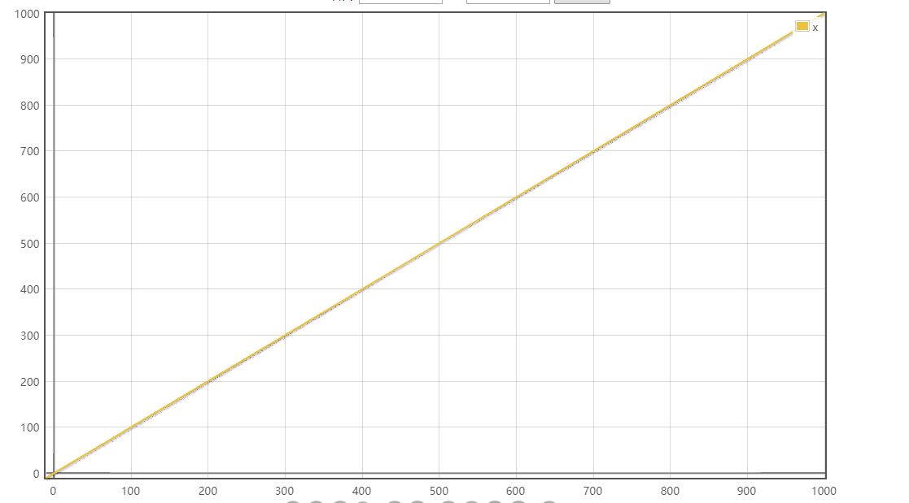
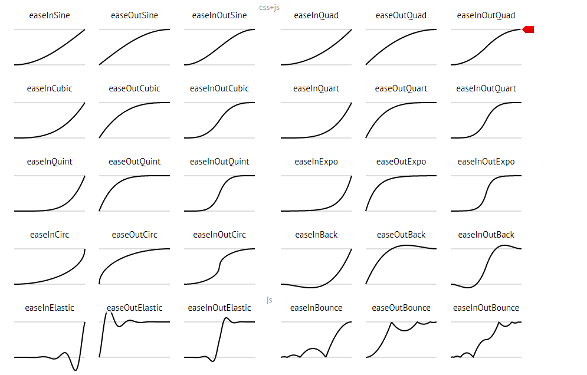

## 动画中的变速运动

> 本节链接所有的链接都属于辅助性链接

[上一节]()介绍了requestAnimationFrame，其中使用的运动案例是匀速运动，不过人总是有欲望的，匀速运动看起来太死板了，我们可以让动画变得古灵精怪起来吗？答案是可以的。

### 匀加速运动

在介绍变速运动之前，我们先来介绍一下物理课本中的匀加速运动，匀加速运动。匀加速运动就是加速度是一个恒定的值得一种运动，匀速运动是匀加速运动的一个特例，因为在匀速运动中，加速度为0。首先我们要确定的假设是，在某一个运动中，起点和终点、加速度、初始速度、运动时间都已经明确，我们需要做的只是重现这个运动的过程。接上上一节的内容，我们只需要再加一个加速度a即可完成动画。

代码如下：

```javascript 1.6
const L = 1000; // 假设总长度为1000
const a = 20 / 1000;   // 加速度 ，单位是 长度/毫秒的平方
const startTime = Date.now();
let spend = 0;
let moved = 0;

let timer;

// 定义一个每一帧的回调函数
const eachFrame = () => {
    // 以ms为单位
     spend = Date.now() - startTime;
     // 乘以加速度
    moved = (a * spend * spend) / 2;
    
    /*
        接下来你就可以将这个moved写入具体的运动元素中了。
     */
    
    console.log(moved);
    
    if (moved <= L) {
        // 这里再次调用requestAnimationFrame
        timer = window.requestAnimationFrame(eachFrame); 
    }
     
};

timer = window.requestAnimationFrame(eachFrame);
```

在上面的代码中，我们简单地运用了匀加速运动的公式来完成动画，现在我们来思考一下，如果我们的动画是需要先加速到L=1200的位置，然后再返回L=1000的位置？上面的代码是做不到的，因为我们是通过判断总路程的长度是否大于预定路程来结束动画的，那么我们应该怎么做呢？

### 变速运动

#### 关注运动时间，而不是运动路程

简单的解决办法那就是不用路程是否超出预期路程来决定是否停止动画，而是使用时间，这样在运动过程中，路程怎么变化就只是一个运动结果的问题了。

首先我们依然假设在运动过程中速度v不会发生变化，沿用上一节中的所有运动变量（L、T、spend、moved、startTime、v），但是在上一节中，时间t是一个斜率为1的线段函数，它的函数图像如下图所示：


如果我们让时间t的函数是一个非线性的函数，那么是不是也可以达到非线性动画的效果呢？答案是肯定的，因为在线性路程的公式中——s(t) = vf(t)，v是常量（速度），f(t)是一个关于时间t的非线性函数，那么s(t)也就是一个非线性的函数。

虽说f(t)是一个非线性函数，它也必须满足两个条件，那就是：

```javascript 1.6
f(0) = 0;
f(T) = T;   //  T是总的运动时间
```

这样的函数图像好画吗？好画。这样的函数好找吗？不好找！但是我们要是改变一下s(t)的表达式呢？改成——s(t) = v * T * g(x),其中x=t/T。那么相应的，条件g(x)也变成了如下：
```javascript 1.6
g(0) = 0;
g(1) = 1;   // 当t等于T的时候，x=1
```

现在来看的话，满足g(x)的函数就太多了，比如：g(x) = x * x, g(x) = x * x * x……，其中，g(x) = x就是一个线性的函数。


#### 动起来

假设现在的g(x) = x * x,也就是等于 g(t) = t / T * t / T,那动画可以这么写。

```javascript 1.6
const L = 1000; // 假设总长度为1000
const T = 3000; // 动画时间 ms
const v = L / T;
const startTime = Date.now();
let spend = 0;
let moved = 0;

let timer;

const g = (t) => {return t / T * t / T;};

// 定义一个每一帧的回调函数
const eachFrame = () => {
    // 以ms为单位
    spend = Date.now() - startTime;
    moved = g(spend) * T * v;
    
    /*
        接下来你就可以将这个moved写入具体的运动元素中了。
     */
    
    console.log(moved);
    
    // 判断总时间
    if (spend <= T) {
        // 这里再次调用requestAnimationFrame
        timer = window.requestAnimationFrame(eachFrame); 
    }
     
};

timer = window.requestAnimationFrame(eachFrame);
```

#### 缓动函数（Ease）

上一小节说的g(x)我们称之为缓动函数（这应该不是数学术语），有很多缓动函数已经被人们发掘出来，下面贴出一小点部分作为示例：

```javascript 1.6
const inOutCube = (x) => {
  x *= 2;
  if (x < 1) return 0.5 * x * x * x;
  return 0.5 * ((x -= 2 ) * x * x + 2);
};

const inQuart = (x) => {
  return x * x * x * x;
};

const outQuart = (x) => {
  return 1 - (--x * x * x * x);
};

```

更多地函数图像如下：



[下一节构建一个你的动画库]()